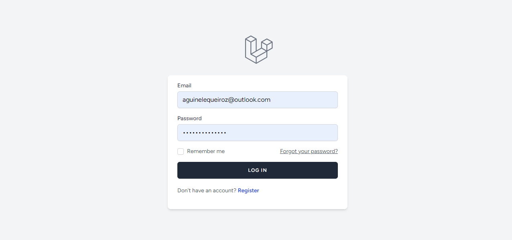
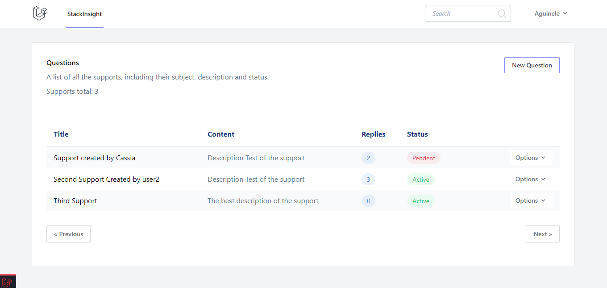
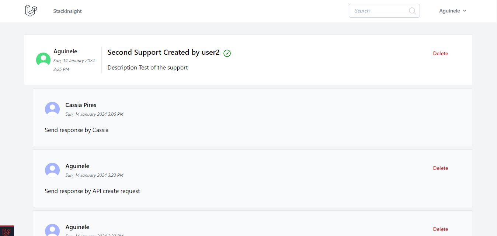

# Stack Insight
O objetivo deste projeto foi aplicar os conhecimentos acerca de 
boas práticas de desenvolvimento, conceitos de arquitetura e 
um pouco de clean code. O sistema é um fórum de perguntas e 
respostas, em que foram implementadas todas as lógicas referentes 
a segurança mínima dos dados de cada usuário (ACL), alguns padrões 
de projeto como Adapter, Repository, Service Layer, com o  intuito 
de tornar o código da aplicação o mais  simples de corrigir, compreender 
e principalmente reaproveitar. Tornado-a bastante escalável. Além de outros conceitos muito comuns no 
desenvolvimento de software como eventos, listeners, Emails e outros.

### Tecnologias
As ferramentas utilizadas foram as seguintes:

-[x] Docker
-[x] Laravel Framework - version 10
-[x] Javascript
-[x] PHP 8.1
-[x] MySQL
-[x] Redis

### Telas







### Como executar
Clone Repositório
```sh
https://github.com/AguineleQueiroz/stack-insight-app.git
```
```sh
cd app-laravel
```


Crie o Arquivo .env
```sh
cp .env.example .env
```


Atualize as variáveis de ambiente do arquivo .env
```dosini
APP_NAME= "name_app"
APP_URL=http://localhost:8989

DB_CONNECTION=mysql
DB_HOST=mysql
DB_PORT=3306
DB_DATABASE=nome_que_desejar_db
DB_USERNAME=nome_usuario
DB_PASSWORD=senha_aqui

CACHE_DRIVER=redis
QUEUE_CONNECTION=redis
SESSION_DRIVER=redis

REDIS_HOST=redis
REDIS_PASSWORD=null
REDIS_PORT=6379
```


Suba os containers do projeto
```sh
docker-compose up -d
```


Acesse o container app
```sh
docker-compose exec app bash
```


Instale as dependências do projeto
```sh
composer install
```


Gere a key do projeto Laravel
```sh
php artisan key:generate
```


Acesse o projeto
[http://localhost:8989](http://localhost:8989)
